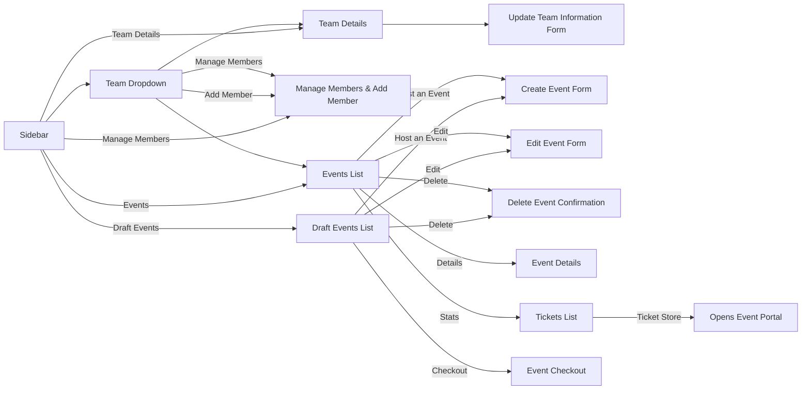
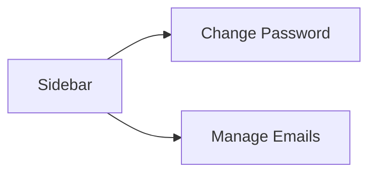
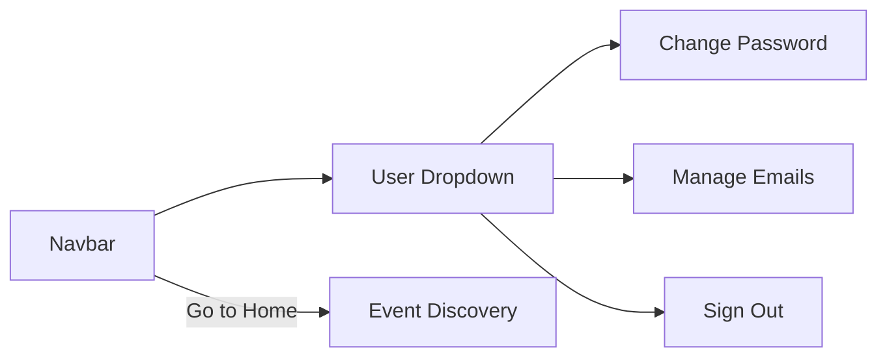

# Dashboard

The dashboard is the part of SocialPass that lets users (event organizers) create events on the platform. There's also a team manager part of the dashboard, which allows them to manage team members for proper collaboration.

## Requirements

The app should allow users (organizers) to do the following things:

- Create, update, delete events
- Allow events to be stored as draft
- Manage team details (for branding)
- Add or remove team members
- Manage account information (such as email addresses and passwords)

Apart from the above functional requirements, the app should also adhere to the following:

- Load reasonably fast and work on all browsers
- Be available only for authenticated users

## User Flows

The dashboard has two parts - the event manager and the account manager. In both cases, the main entry point is the sidebar, as this is used for all of the main navigation on the product.

### Event Manager

### Account Manager

### Navbar

There is another entry point - the navbar, and this mainly leads to pages in the account manager from the user dropdown.

