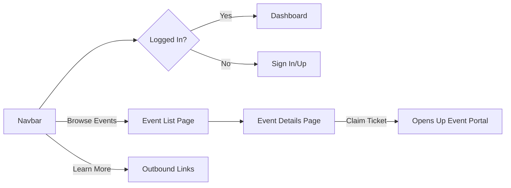
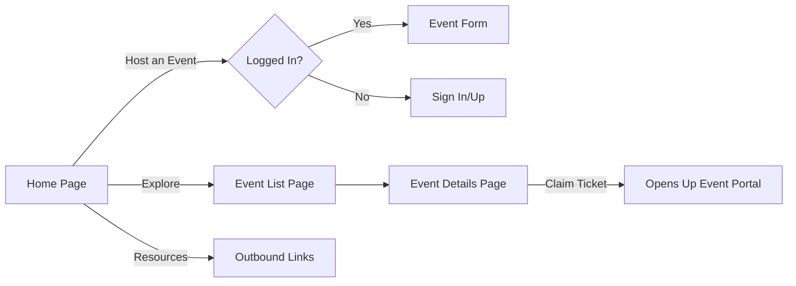

# Event Discovery

The Event Discovery is the part of SocialPass that contains the landing page (along with the marketing information), and also a public page containing a paginated list of events. The platform is meant to work as a public interface between the product and actual people attending events - anyone can browse through events and go to the details page to claim their ticket (which opens up the Event Portal app in a dialog box).

## Requirements

The app fulfills the following requirements:

- Home page with up-to-date marketing information
- Event list page with search and pagination (location and date filters planned in the future)
- Event details page which allows users to claim their tickets
- Load reasonably fast and work on all browsers
- All the pages should be publicly available, that is, require no authentication

## User Flows

The Event Discovery platform has two entry points, and therefore two user flows - one from the navbar which is present in all of the pages, and one from the home page itself.

### Navbar

### Home Page

## Routes

The following routes are available on the app:

- `http://127.0.0.1:8000/` - Home page
- `http://127.0.0.1:8000/events/browse` - Event list page
- `http://127.0.0.1:8000/events/<public_id>` - Event details page
